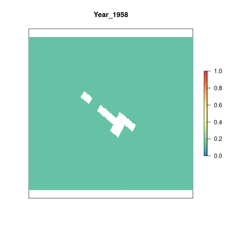

# Summary 

This ocean acidification (OA) pressure layer for Palmyra Atoll is derived from a monthly raster of aragonite saturation states. The global assessment processes this data to rescale values 0-1 based on a biological threshold and the proportional change compared to a historical mean. This script starts with the rescaled raster and does the following:   
  
- Clips rescaled rasters to the coast using a 3 nautical mile offshore buffer   
- Resamples raster to ~ 1km^2^ and reprojects to US Albers projection   

***

# Data

**Reference**: [Feely et al.(2009)](https://darchive.mblwhoilibrary.org/bitstream/handle/1912/3180/22-4_feely.pdf?sequence=1&isAllowed=y)

**Downloaded**: July 19, 2017

**Description**: Aragonite Saturation State  $\Omega_{arg}$

**Native data resolution**: 1 degree cells

**Time range**: 1880-1889 and 1958-2100, monthly data provided for each year. Future years are based on model projections for RCP 8.5. Previous years are hindcast/historical data.

**Format**: NetCDF

**Citation information**: Woods Hole Oceanographic Institution. 2014 update to data originally published in: Feely, R.A., S.C. Doney, and S.R. Cooley. 2009. Ocean acidification: Present conditions and future changes in a high-CO2 world. Oceanography 22(4):36–47

**Notes about the data**: This data was shared with NCEAS by Ivan Lima from Woods Hole Institute for Oceanography in July 2017. Originally, data were provided from 1958 - 2016; additional years of data up until 2020 were received from Ivan Lima. The data came as NetCDFs with a resolution of about 1 degree. The data values are monthly average surface &#937; aragonite saturation state.

***

# Setup 

```{r setup, message = F, warning = F}

# Set options for all chunks in code
knitr::opts_chunk$set(warning=FALSE, message=FALSE, fig.width=6, fig.height=6)

library(raster)
library(ncdf4)
library(maps)
library(parallel)
library(foreach)
library(doParallel)
library(RColorBrewer)
library(fasterize)
library(rasterVis)
library(here)
library(gstat)
library(scales)
library(animation)

# Source and set file paths
source(here('src/R/common.R'))

raw_dir <- file.path(dir_M, 'git-annex/globalprep/_raw_data') # Path to raw data held on NCEAS server, Mazu
dir_prs <- '~/github/pal-prep/prep/pressures/oa/v2020'

```

***

# Methods

## Load Processed Data

Data for ocean acidification has been processed for the global assessment to give a value 0-1 for each year from 1958 - 2020 using both a historical reference period and a biological reference point. All cells with values less than 1, indicating an undersaturated state, are set equal to the highest stressor level, 1. For all other cells, rescaling the aragonite saturation state value to between 0 and 1 relies upon the change in saturation relative to the reference period. Additional information on how this data is processed to obtain 0-1 scores can be found [here](). 

```{r load-processed-data, eval=F}
oa_rasts <- c(list.files(file.path(dir_M, "git-annex/globalprep/prs_oa/v2017/output"),full.names=T))

# Plot the 2020 data to check rasters:
plot(raster(oa_rasts[64]), col=cols,box=F,axes=F, main = 'Rescaled Ωaragonite layer for 2020')
```

## Reproject Global Data 

Reproject the global data to US Albers and crop to Palmyra's extent  

```{r reproject-data, eval=F}

# Only need oa rasters 2-64, these are the annual oa rasters
oa_rast_annual <- oa_rasts[2:64]

# 3nm Buffer raster for cropping
three_nm <- ocean_rast3_100
three_nm <- raster::crop(three_nm, usalb_ext3) # Crop to Palmyra extent
plot(three_nm)

# Register 10 cores for parallel processing
registerDoParallel(10)

foreach(file = oa_rast_annual) %dopar% {
  #file = oa_rast_annual[1]
  
  yr = substr(file,72,75)
  
  r <- raster(file)
 
  rast_reproj <- projectRaster(r, three_nm, method = 'ngb') %>% 
          crop(usalb_ext3) %>%
          writeRaster(., filename = paste0(file.path(dir_anx), '/dataprep/prs_oa/output/oa_rasts_us_albers/oa_', yr, '.tif'), overwrite=T)
 
}

# Plot 2020 raster to check:
plot(raster(file.path(dir_anx, "dataprep/prs_oa/output/oa_rasts_us_albers/oa_2020.tif")))
```
## Check for Gapfilled Cells 

Some of the cells in the cropped rasters look like they're missing. Check global raster for interpolated cells.   

```{r check-interp-cells, eval=F}
# Interpolated global data:
interp_gl <- raster(file.path(dir_M, 'git-annex/globalprep/prs_oa/v2017/output/oa_interpolated_cells.tif')) # CRS = mollewide equal area

## Get extent in mollewide equal area for Palmyra 
extent(pal_buffer_3nm)
moll_ext <- extent(-16200173, -16182605, 719838.4, 733708.5)

# Crop global raster to Palmyra ext
pal_interp <- interp_gl %>% 
  crop(moll_ext)

# Plot 
plot(pal_interp, col=cols, box=F, axes=F, main='Interpolated cells') # Blank - maybe this means no cells were interpolated? 

## Check shapefile over the raster
plot(raster(file.path(dir_anx, "dataprep/prs_oa/output/oa_rasts_us_albers/oa_2020.tif")))
plot(pal_shore_alb, add = T, col = "grey")
```

Must just be lower resolution than the shapefiles, looks like its supposed to be the land area of Palmyra, it just doesn't have the same level of detail. 

# Results

```{r gif-results, eval=F}

oa_coastal_rasts <- list.files(file.path(dir_anx, 'dataprep/prs_oa/output/oa_rasts_us_albers'), full.names = T) %>% 
                           stack()

names(oa_coastal_rasts) <- paste0("Year_", substr(names(oa_coastal_rasts),4,7))

# Make a gif animation
animation::saveGIF({
  for(i in 1:nlayers(oa_coastal_rasts)){
     plot(oa_coastal_rasts[[i]], col='cornsilk2', main=names(oa_coastal_rasts[[i]]), axes=F, legend=F)
      # don't forget to fix the zlimits
    plot(oa_coastal_rasts[[i]], zlim=c(0,1), axes=F, col=cols, add=T)
      
  }
}, movie.name = 'oa_annual_rescaled.gif')

```



## Extract Values 

Extract values for Palmyra 

```{r extract-values, eval=F}
## Read in raster files
pressure_stack <- lapply(list.files(file.path(dir_anx, 'dataprep/prs_oa/output/oa_rasts_us_albers'), full.names=T), raster) %>%
  brick()

# Extract data for Palmyra:
pal_regionstats <- cellStats(pressure_stack, mean)%>% 
  as.data.frame() %>% 
  rename(pressure_score = ".") %>% 
  tibble::rownames_to_column("file_name") %>% 
  mutate(year = substr(file_name, 4, 7)) %>% 
  select(-file_name) %>% 
  mutate(region_id = 1, 
         year = as.numeric(year))

# Finalized data frame for pressure score:
oa_data <- pal_regionstats %>% 
  filter(year >= 2005) %>% 
  dplyr::select(region_id, year, pressure_score)

# Save to output folder
write_csv(oa_data, file.path(dir_prs, "output/oa_pressure.csv"))
```

## 2020 scores

Check the scores for 2020.  

```{r map-scores}
# Source the plot scores function 
source(here('src/R/plot_scores.R'))

# Use oa output data
oa_data <- read_csv(file.path(dir_prs, "output/oa_pressure.csv"))

last_year <- oa_data %>%
  filter(year==2020)

## map_scores is a function to plot a tmap map of the scores
map_scores(score_obj = last_year, score_var = last_year$pressure_score, scale_label = "Pressure Score", map_title = "Ocean Acidification")
```

## Visualize Through Time

Basic visualization of pressure scores over time.  

```{r graph-scores-overtime}
# Graph pressure scores over time 
oa_overtime <-ggplot(oa_data)+
  geom_line(aes(x=year, y = pressure_score), color="dodgerblue4")+
  ggtitle("Ocean Acidification Pressure Score") +
  ylab("Score") +
  xlab("Year") +
  theme_classic() 
oa_overtime

# Save output
ggsave(file.path(dir_prs, "figs/scores_2005-2020.png"), width=7, height=5, dpi=300)

```

## Save to Toolbox 

```{r save-to-toolbox, eval=F}
oa_data <- read_csv(file.path(dir_prs, "output/oa_pressure.csv"))
write_csv(oa_data, file.path(dir_scores, "layers/prs_cc_oa.csv"))
```


############### OLD GLOBAL CODE #######################

NCEAS received new data from Ivan Lima at WHOI from 1958 - 2016. This is provided in a single NetCDF file and on a regular 1x1 degree grid.

```{r load-global-data, eval=F}

# Read in 1958-2016 data
raw <- stack(file.path(raw_dir, 'WHOI/cesm_co2sys_1958-2016.1x1d.nc'), varname="OARG") # Grab aragonite variable using varname
                    
plot(raw[[1]]) # We'll have to rotate the rasters
plot(rotate(raw[[1]]))
maps::map('world', col='gray95', fill=T, border='gray80', add=T)

```

## Historical Mean

The historical mean aragonite saturation state from 1880 - 1889 was calculated for OHI global 2015. The same raster was used for OHI global 2016 and is again used here for comparison.

```{r hist-mean, eval=F}

hist <- raster(file.path(dir_M, 'git-annex/globalprep/prs_oa/v2015/working/global_oa_1880_1889_arag_mean_moll.tif'))

plot(hist, main='Mean Ωaragonite 1880-1889', col=rev(cols), box=F, axes=F)

```

## Create Annual Means

Since this data is now on a regular grid, but the historical data from 1880-1889 was transformed previously from an irregular grid, there will be issues matching up the resolution and extent so we will need to use this historical mean raster that we created for OHI global 2015 and on, to use as a template for resampling.

```{r create-annual-means,eval=F}

# Register 10 cores for parallel processing
registerDoParallel(10)

foreach (i = seq(1,708, by=12)) %dopar% {
  i = 1
  j = i+11
  
  yr = substr(names(raw[[i]]),2,5)
  
  # Reproject historical raster to us albers 
  hist_alb <- projectRaster(from=hist, crs=us_alb)
  
  # Yearly means:
  yr_mean = raw[[i:j]] %>%
            calc(fun=function(x){mean(x, na.rm=T)}) %>%
            rotate() %>% 
            projectRaster(ocean_rast3_100, method = 'ngb') %>% 
            crop(usalb_ext3) %>%
          writeRaster(., filename = paste0(file.path(dir_anx), '/dataprep/prs_oa/int/annual_avg_us_albers/pal_arag_avg_us_albers_', yr, '.tif'), overwrite=T)
 
}


plot(yr_mean) 
plot(ocean_rast3_100, add=T, col="#4566FE80")
plot(pal_shore_alb, add=T)

zonal(yr_mean, ocean_rast3_100, fun = "mean", na.rm=TRUE)
```


OlD CODE JUST IN CASE:

```{r}
  yr_mean = raw[[i:j]] %>%
            calc(fun=function(x){mean(x, na.rm=T)}) %>%
            rotate() %>%
            resample(hist, method = 'bilinear') %>%
            projectRaster(ocean_rast3_100) %>% # Reproject to Palmyra ocean raster
            crop(usalb_ext3) %>% #returning a blank raster
          writeRaster(., filename = paste0(file.path(dir_anx), '/prs_oa/int/annual_avg_azimuthal/tet_arag_avg_azimuthal_', yr, '.tif'), overwrite=T)
```
  

Check the rasters by plotting mean OA in 2016
```{r plot-mean-2016, eval=F}

# Here is the output for 2016
r_2016 <- raster(file.path(dir_anx,'dataprep/prs_oa/int/annual_avg_us_albers/pal_arag_avg_us_albers_2016.tif'))

plot(r_2016, box=F, axes=F, main="Mean Ωaragonite saturation state 2016", col=rev(cols))
 
```

## Rescale from 0 to 1

This pressure layer is rescaled so that all values lie between 0 and 1 using both a historical reference period and a biological reference point. All cells with values less than 1, indicating an undersaturated state, are set equal to the highest stressor level, 1. For all other cells, rescaling the aragonite saturation state value to between 0 and 1 relies upon the change in saturation relative to the reference period.

Deviation from aragonite saturation state is determined for each year in the study period using this equation:

$$\Delta \Omega_{year} = \frac{(\Omega_{base} - \Omega_{year})}{(\Omega_{base} - 1)}$$

Note that the current value is subtracted from the baseline; this way, a reduction in $\Omega$ becomes a positive pressure value.  It is then normalized by the current mean state; so a decrease in $\Omega$ while the current state is high indicates less pressure than the same decrease when the current state is near 1. 

$\Delta \Omega_{year}$ is then modified to account for increases in aragonite saturation state (pressure = 0) and aragonite saturation state less than 1 (pressure = 1).

The `oaRescale` function rescales each of the annual rasters. If the current value is less than or equal to 1, it is set to 1, otherwise the value is calculated from the above equation.

```{r rescale, eval=F}

# For each layer, all values <=1 are assigned a 1, otherwise old-new/(old-1)
oaRescale <- function(file){
  
  yr   = substr(file, nchar(file)-7, nchar(file)-4) # Get year of file
  mean = raster(file)                               # Get seasonal mean aragonite raster for given year
  diff = (hist-mean)/(hist-1)
  mean[mean<=1] <- 1                                # All values at or less than 1 are given a value of 1
  mean[mean>1]  <- diff[mean>1]                     # All cells with values greater than 1 are swapped out with their amount of change scaled to how close to 1 
  mean[mean<0]  <- 0                                # All values less than 0 (indicating a decrease in acidity) are capped at 0

    writeRaster(mean, filename = paste0(dir_anx, '/dataprep/prs_oa/int/annual_avg_us_albers_rescaled/oa_rescaled_', yr, sep=""), format='GTiff', overwrite=TRUE)
}

files = list.files(file.path(dir_anx, 'dataprep/prs_oa/int/annual_avg_us_albers'), full.names=TRUE)

mclapply(files, oaRescale, mc.cores = 16)

```

```{r plot rescale}

# Here is the rescaled output for 2016
r <- raster(file.path(dir_anx, 'dataprep/prs_oa/int/annual_avg_us_albers_rescaled/oa_rescaled_2016.tif'))

plot(r, col=cols, box=F, axes=F, main = 'Rescaled Ωaragonite layer for 2016')

```

## Interpolate

Since there are oceanic cells with no information in the raw data, we need to fill in these gaps. We do this by interpolating across the globe using the data we have with an Inverse Distance Weighting (IDW) function. Previously this was done using `arcpy` from ArcGIS.

```{r interpolate,eval=F}

library(gstat)

# Register 24 cores for parallel processing
registerDoParallel(24)

files <- list.files(file.path(dir_anx,'dataprep/prs_oa/int/annual_avg_us_albers_rescaled'), full.names=TRUE)

foreach(file = files) %dopar%{

r     <- raster(file)                                     # OA raster
yr    <- substr(file, nchar(file)-7, nchar(file)-4)
xy    <- data.frame(xyFromCell(r, 1:ncell(r)))            # Get xy coords into dataframe
v     <- getValues(r)                                     # Get cell values 
tmpdf <- cbind(xy, v) %>% filter(!is.na(v))               # Create dataframe of x,y, and values. Remove NAs (throws error since these are cells we are interpolating over)
mg    <- gstat(id = "v", formula = v~1, locations = ~x+y, 
               data=tmpdf, nmax=7, set=list(idp = 2))     # Define model. Power function = 2, this is default for IDW models
z     <- interpolate(r, mg, progress='text')              # Interpolate across NA cells

writeRaster(z, filename = paste0(file.path(dir_anx), "dataprep/prs_oa/int/annual_avg_us_albers_rescaled_int/oa_resc_int_", yr, ".tif"), overwrite=T)
}

```

```{r plot_interpolated_2016}

plot(raster(file.path(dir_anx,'dataprep/prs_oa/int/annual_avg_us_albers_rescaled_int/oa_resc_int_2016.tif')), col=cols, box=FALSE, axes=FALSE, main='Rescaled and Interpolated Ωaragonite layer for 2016')

```

## Resample & Land Mask

All pressure layers need to be resampled to 1km^2^ cell resolution. We have a template ocean raster with cells at this resolution that we use to resample all pressure layers. You won't see any difference between the plot above and this one since we are using the nearest neighbor method when resampling which maintains the original cell value for each of resampled cell.

```{r resample, eval=F}

ocean <- raster(file.path(dir_M, "git-annex/globalprep/spatial/v2017/ocean.tif"))

files <- list.files(file.path(dir_anx, 'dataprep/prs_oa/int/annual_avg_us_albers_rescaled_int'), full.names = TRUE)

foreach(file = files) %dopar% {
# file <- files[1]
  yr <- substr(file, nchar(file)-7, nchar(file)-4)
  cat(yr)
  raster(file) %>%
  resample(ocean, method = 'ngb') %>%
  mask(ocean, filename = paste0(dir_anx, '/dataprep/prs_oa/output/oa_prs_layer_', yr, '.tif'), overwrite=TRUE)
}

```

***

# Results

## Final Pressure Layer

```{r plot_final}

# Plot final OA pressure layer for 2016
plot(raster(file.path(dir_anx, 'dataprep/prs_oa/output/oa_prs_layer_2016.tif')), box=F, axes=F, col=cols, main='Final Ocean Acidification \nPressure Layer 2016')

```

## Gapfilled cells

We want to create a raster layer that shows all cells that were gapfilled. Since they were the same cells interpolated across all years, we only need to create one raster.

```{r gapfilled, eval=F}

# Rescaled data before interpolation 
pre_int = raster(file.path(dir_anx, 'dataprep/prs_oa/int/annual_avg_us_albers_rescaled/oa_rescaled_2016.tif')) %>%
                resample(ocean, progress='text', method = 'ngb')

# After interpolation
r_int = raster(file.path(dir_anx, 'dataprep/prs_oa/output/oa_prs_layer_2016.tif'))
    
# Interpolated (or gapfilled) cells    
interp_cells = mask(r_int, pre_int, inverse=TRUE, filename = file.path(dir_anx, 'dataprep/prs_oa/output/oa_interpolated_cells.tif'))

```


