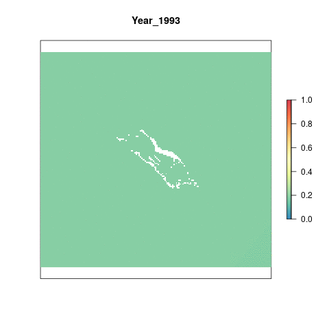

# Summary 

The sea level rise (SLR) pressure layer for Palmyra is derived from a global raster of monthly data indicating mean sea level anomalies from 1993 to 2018. This preparation script does the following for newly available global SLR data:
  
- Clips mean annual sea level anomaly rasters to the coast using a 3 nautical mile offshore buffer   
- Rescales values from 0 to 1 using the reference point (maximum annual anomaly across the time series)
- Sets to zero all negative values, indicating decreases in mean sea level
- Resamples raster to ~ 1km^2^ and reprojects to US Albers projection

This process is completed entirely within this script. The raw data is downloaded externally and held on a server at NCEAS. Although the raw data is not provided, this script can be used on the data downloaded from Aviso [here](https://www.aviso.altimetry.fr/data/products/sea-surface-height-products/global/gridded-sea-level-anomalies-mean-and-climatology.html). You will need to register with Aviso in order to get a username and password for data access.

***

# Data

The source data are monthly mean sea level anomalies, in meters. These anomalies are calculated by subtracting the current absolute sea level for each month from the average sea level for that month calculated from 1993 - 2019.

**Reference**: AVISO [Monthly mean Maps of Sea Level Anomaly](https://www.aviso.altimetry.fr/data/products/sea-surface-height-products/global/gridded-sea-level-anomalies-mean-and-climatology.html)

**Downloaded**: 

**Description**: Monthly mean sea level anomaly (meters above mean sea level)

**Native data resolution**: 0.25 degree grid cells

**Time range**: January 1993 - 20??, monthly data provided for each year

**Format**: NetCDF

***

# Setup 

```{r setup, message = F, warning = F}

knitr::opts_chunk$set(fig.width = 10, fig.height = 8, fig.path = 'figs/', message = FALSE, warning = FALSE)

library(raster)
library(tidyverse)
library(sf)
library(RColorBrewer)
library(googleVis)
library(foreach)
library(doParallel)
library(fasterize)
library(rasterVis)
library(animation)
library(here)

# Source and set file paths
source(here('src/R/common.R'))

dir_prs    <- '~/github/pal-prep/prep/pressures/slr/v2020'
dir_slr_gl <- file.path(dir_M, "git-annex/globalprep/prs_slr/v2020")

```

***

# Methods

## Load Annual Mean Anomalies 

We don't need to download the data from the AVISO website because it's already been downloaded for the most recent year of global. The global assessment has also already calculated annual monthly means, which we will use as the starting point for this script.   

```{r get-annual-means, eval=F}

# Annual means from 1993-2018
slr_msla_annual_files <- list.files(file.path(dir_slr_gl, "int/msla_annual_mean"),
                       full.names = TRUE, pattern = ".tif")

# Plot to check:
plot(raster(slr_msla_annual_files[1]), col = cols, axes = F, 
     main = paste("Year", substr(slr_msla_annual_files[1], 86, 89)))

```

## Project and Mask 

Since we are only interested in the increase in sea level near the coasts, we apply a mask to the raster layers that removes all cells farther than 3nm offshore. This mask was created previously for another part of this assessment. We also re-project to US Albers for consistency with the rest of the assessment.   

```{r projection-masking, results = 'hide'}

## 3nm offshore raster to select only nearshore cells
three_nm <- ocean_rast3_100
three_nm <- raster::crop(three_nm, usalb_ext3) # Crop to Palmyra extent
plot(three_nm)

## Re-project means to us albers

foreach(file = slr_msla_annual_files) %dopar% {  
  
  #file = slr_msla_annual_files[26]
  yr <- str_sub(file, 86, 89)
  
  rast_data <- raster(file)
  
  rast_data_reproj <- projectRaster(from=rast_data, to=three_nm, crs=us_alb, method = "ngb", over=FALSE) %>% 
    #projectRaster(crs = us_alb, over = FALSE, progress="text") %>% #problem in this line - goes from having values to values being NA
    raster::resample(three_nm, method = "ngb", 
             filename = sprintf("%s/dataprep/prs_slr/int/msla_annual_us_albers/mlsa_annual_us_albers_%s.tif", 
                                dir_anx, yr), overwrite = TRUE) %>% 
    mask(three_nm, filename = sprintf("%s/dataprep/prs_slr/int/msla_annual_us_albers_coastal/msla_annual_us_albers_coastal_%s.tif", dir_anx, yr), overwrite = TRUE)
}

# Plot 2018 raster to check:
plot(raster(file.path(dir_anx, "dataprep/prs_slr/int/msla_annual_us_albers_coastal/msla_annual_us_albers_coastal_2018.tif")))

```


## Reference Point

We are using a reference point 1.1 times larger than the maximum value in Palmyra from 1993-2018. The current maximum value is unlikely to be the future max, and setting this reference point allows for an increase in sea level rise pressure into the future.

```{r reference-point, eval=F}

coastal_rasts <- list.files(file.path(dir_anx, "dataprep/prs_slr/int/msla_annual_us_albers_coastal"), pattern = "tif", full.names = TRUE)

# Get data across all years
registerDoParallel(8)

vals <- foreach(i = 1993:2018, .combine = c) %dopar% { 
  #i = 2018
  
  coastal_rasts[which(str_sub(coastal_rasts, -8, -5) == i)] %>%
    raster() %>%
    getValues() %>%
    na.omit()
  
}

ref <- 1.1*max(vals)

```

The reference point is `r ref` meters.


## Rescale

We use the reference point to rescale all values from 0 to 1. If a value is greater than the reference point, it is automatically given a value of 1.

```{r rescale, results='hide'}

registerDoParallel(10) 

foreach(file = coastal_rasts) %dopar% { 
  #file = coastal_rasts[10]
  
  yr <- str_sub(file, -8,-5)
  
    raster::raster(file) %>%
    calc(fun = function(x){ifelse(x < 0, 0, x)}) %>% # Set all negative values to 0
    calc(fun = function(x){ifelse(x > ref, 1, x/ref)}, # Set equal to 1 if greater than ref, otherwise scale
         filename = sprintf("%s/dataprep/prs_slr/output/msla_rescaled/slr_%s.tif", dir_anx, yr), overwrite = TRUE)
    
}

```

***

# Results

```{r gif-results, eval=F}

coastal_rasts <- list.files(file.path(dir_anx, 'dataprep/prs_slr/output/msla_rescaled'), full.names = T) %>% 
                           stack()
                         
names(coastal_rasts) <- paste0("Year_", substr(names(coastal_rasts),5,8))

# Remove the 2019 layer (27th layer) - it isn't complete for all months
coastal_rasts <- dropLayer(coastal_rasts, 27)

# Make a gif animation
animation::saveGIF({
  for(i in 1:nlayers(coastal_rasts)){
     plot(coastal_rasts[[i]], col='cornsilk2', main=names(coastal_rasts[[i]]), axes=F, legend=F)
      # don't forget to fix the zlimits
    plot(coastal_rasts[[i]], zlim=c(0,1), axes=F, col=cols, add=T)
      
  }
}, movie.name = 'slr_annual_rescaled.gif')

```




## Extract Scores

Extract data per year for the entire Palmyra region.  

```{r extract-scores, eval=F}

## Read in raster files
pressure_stack <- lapply(list.files(file.path(dir_anx, 'dataprep/prs_slr/output/msla_rescaled'), full.names=T), raster) %>%
  brick()

# Extract data for Palmyra:
slr_data <- cellStats(pressure_stack, mean)%>% 
  as.data.frame() %>% 
  rename(pressure_score = ".") %>% 
  tibble::rownames_to_column("file_name") %>% 
  mutate(year = substr(file_name, 5, 8)) %>% 
  dplyr::select(-file_name) %>% 
  mutate(region_id = 1, 
         year = as.numeric(year)) %>% 
  filter(year != 2019) %>%  # incomplete data
  dplyr::select(region_id, year, pressure_score)

# Save to output folder
write.csv(slr_data, file.path(dir_prs, "output/slr_pressure.csv"))
```

## 2018 scores

Check the scores for 2018, the last full year of available data

```{r map-scores, eval=F}

# Source the plot scores function 
source(here('src/R/plot_scores.R'))

# Use slr output data
slr_data <- read_csv(file.path(dir_prs, "output/slr_pressure.csv"))

last_year <- slr_data %>%
  filter(year==2018)

## map_scores is a function to plot a tmap map of the scores
map_scores(score_obj = last_year, score_var = last_year$pressure_score, scale_label = "Pressure Score", map_title = "Sea Level Rise")

```


## Visualize through time

```{r graph-scores-overtime}

slr_overtime <- ggplot(slr_data) +
  geom_line(aes(x=year, y = pressure_score), color="dodgerblue4")+
  ggtitle("Sea Level Rise Pressure Score") +
  ylab("Score") +
  xlab("Year") +
  theme_classic() 
slr_overtime


ggsave(file.path(dir_prs, "figs/scores_2005-2020.png"), width=7, height=5, dpi=300)

```


## Save To Toolbox

```{r save-to-toolbox, eval=F}
slr_pressure <- read_csv(file.path(dir_prs, "output/slr_pressure.csv")) %>% 
  dplyr::select(-X1)
write.csv(slr_data, file.path(dir_scores, "layers/prs_cc_slr.csv", row.names=FALSE)
```
