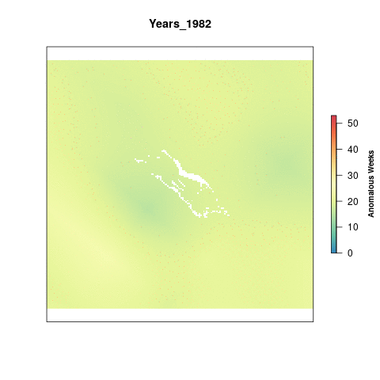
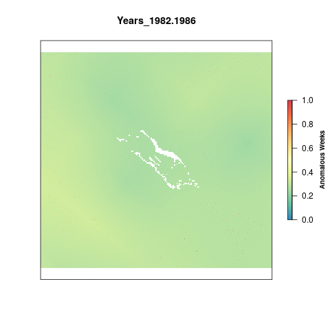

# Summary

For the sea surface temperature pressure we calculated the number of times Palmyra's weekly SST was greater than the climatological mean for that week (an anomaly: greater than mean + one standard deviation) and summed the number of weekly anomalies in a single year. The maximum value a cell could have is 52 which would mean that cell had anomalous SST temperatures for each week of the year.

To account for annual variation, we look at Sea Surface Temperature anomalies in 5 year periods, so the maximum value possible per cell is 260 anomalous weeks. To rescale the values from 0 to 1 we set a reference point. Previously, the reference point for SST has just been the maximum difference in anomalous weeks between the most recent time period and a historical reference period (1985-1989).

This time we have decided to use a reference point that represents a regime shift. Once a given cell is anomalous for more than 50% of a five-year period, it has shifted into a new regime. All cells that have a value greater than 130 weeks (51% of a 5 year time period) are assigned a 1. The rest of the cells are scaled to this reference point by dividing by 130.

***

# Data 

**Source**: The [Coral Reef Temperature Anomaly Database Version 6 (CoRTAD)](https://data.nodc.noaa.gov/cgi-bin/iso?id=gov.noaa.nodc:0175483)  

**Downloaded**: July 23, 2020    

**Description**:  Sea Surface Temperature Anomalies (Kelvin)  

**Native data resolution**: 4km^2^    

**Time range**: 1982 - 2017  

**Format**:  NetCDF  
  
**Citation**: Saha, Korak; Zhao, Xuepeng; Zhang, Huai-min; Casey, Kenneth S.; Zhang, Dexin; Zhang, Yongsheng; Baker-Yeboah, Sheekela; Relph, John M.; Krishnan, Ajay; Ryan, Thomas (2018). The Coral Reef Temperature Anomaly Database (CoRTAD) Version 6 - Global, 4 km Sea Surface Temperature and Related Thermal Stress Metrics for 1982 to 2017. NOAA National Centers for Environmental Information. Dataset. https://doi.org/10.25921/ffw7-cs39. Accessed: July 23, 2020.   

***

# Setup 

```{r setup, message=F, warning=F, results='hide'}

library(tidyverse)
library(raster)
library(doParallel)
library(janitor)
library(lubridate)
library(here)

# Source and set file paths
source(here('src/R/common.R'))

dir_prs <- '~/github/pal-prep/prep/pressures/sst/v2020'

```

***

# Methods

## Get Global Data

We will use the global data that was processed for OHI Global 2020, which includes data from 1982 - 2017. This data is saved on a server at NCEAS.

```{r get-global-sst-data, eval=F}

sst_global_files <- list.files(file.path(dir_M,'git-annex/globalprep/prs_sst/v2018/int'),
                               pattern = 'annual_pos_anomalies', full.names=T)

# Plot the most recent year of data:
plot(raster(sst_global_files[36]),col=cols,
     main = "Sea Surface Temperature 2017",box=F,axes=F,
     legend.args=list(text='Anomalous Weeks', side=4, font=2, line=2.5, cex=0.8))

```

## Crop to Palmyra

Using the `crop` function from the `raster` package we crop all sst rasters to the Palmyra extent and then reproject them to the US Albers projection for consistency across the assessment. We crop the global rasters first to reduce the time it takes to reproject the rasters. `ocean_rast3_100` is used as a mask to remove land cells from the raster for better visuals.  

```{r crop-to-pal, eval=F}

registerDoParallel(10) # Register 10 cores for parallel processing

foreach(f = sst_global_files) %dopar% {
  #f = sst_global_files[36]
    
  raster(f) %>%                     
    projectRaster(ocean_rast3_100) %>% # reproject to us_alb ocean rast
    crop(usalb_ext3) %>% # Crop to Palmyra extent
    mask(ocean_rast3_100, filename = paste0(file.path(dir_anx),
                                            '/dataprep/prs_sst/output/sst_annual_anoms/annual_anoms_',
                                            substr(basename(f), 25, 28),'.tif'),
         overwrite = T)
}

```

Check the rasters to make sure it makes sense:  

```{r check, eval=F}

# Check a few rasters to make sure this makes sense:
check82 <- raster(file.path(dir_anx,
                            '/dataprep/prs_sst/output/sst_annual_anoms/annual_anoms_1982.tif'))
check17 <- raster(file.path(dir_anx,
                            '/dataprep/prs_sst/output/sst_annual_anoms/annual_anoms_2017.tif'))
    
plot(check82, col=cols, 
     main = "Sea Surface Temperature 1982", 
     legend.args=list(text='Anomalous Weeks', 
                      side=4, font=2, line=2.5, cex=0.8))

plot(check17, col=cols, 
     main = "Sea Surface Temperature 2017",
     legend.args=list(text='Anomalous Weeks', 
                      side=4, font=2, line=2.5, cex=0.8))

```

## Visualize change over time

Visualize the change in sea surface temperature anomalies over time. 

```{r gif1, eval=F}

l <- lapply(list.files(file.path(dir_anx, '/dataprep/prs_sst/output/sst_annual_anoms'),
                       full.names=T), raster) %>%
  brick()

names(l) <- paste0("Years_",(substr(names(l), 14, 17))) # Rename each layer for plotting
gsub(".", "-", names(l), fixed = TRUE) # Replace the . with a -

# Make a gif animation
library(animation)

saveGIF({
  for(i in 1:nlayers(l)){
      # don't forget to fix the zlimits
      plot(l[[i]], zlim=c(0,53), axes=F, col=cols,
           main=names(l[[i]]),
           legend.args=list(text='Anomalous Weeks', side=4, font=2, line=2.5, cex=0.8))
      
  }
}, movie.name = 'sst_annual_anoms.gif')

```



## Five-year Aggregates

Calculate total anomalous weeks for each 5-year period from 1982 - 2017. 

```{r five-year, eval=F}

l <- list.files(file.path(dir_anx, '/dataprep/prs_sst/output/sst_annual_anoms'),
                full.names=T)

# Last 5 year period will start in 2015
for(i in 1982:2013){ 
  #i=2005
  
  yrs <- c(i, i+1,i+2, i+3, i+4)
  s   <- raster::stack(l[substr(l,100,103) %in% yrs]) %>%
    sum(.)
  
  writeRaster(s, filename = paste0(dir_anx,
                                   '/dataprep/prs_sst/output/sst_5yr_anom_sums/sum_anoms_',
                                   min(yrs), '-', max(yrs), '.tif'), overwrite=T)
}

```

## Rescale

To account for annual variation, we look at Sea Surface Temperature anomalies in 5 year periods, so the maximum value possible per cell is 260 anomalous weeks. To rescale the values from 0 to 1 we need to set a reference point. Previously, the reference point for SST has just been the maximum difference in anomalous weeks between the most recent time period and a historical reference period (1985-1989).

This time we have decided to use a reference point that represents a regime shift. Once a given cell is anomalous for more than 50% of a five-year period, it has shifted into a new regime. All cells that have a value greater than 130 weeks (51% of a 5 year time period) are assigned a 1. The rest of the cells are scaled to this reference point by dividing by 130.

```{r rescale, eval=F}

sst_aggs <- list.files(file.path(dir_anx, '/dataprep/prs_sst/output/sst_5yr_anom_sums'),
                       full.names=T) 

# Define the rescale function
resc_func <- function(x){
  
  # Get the year from the file for naming the output raster
  yrs <- substr(x, 98, 106)
 
  # If a cell value is greater than or equal to the reference point (130 weeks),
  # we assign a value of 1, otherwise it is divided by the reference point
  raster(x) %>%
  calc(., fun=function(x){ifelse(x < 0, 0, ifelse(x > 130, 1, x/130))},
         filename = paste0(dir_anx, '/dataprep/prs_sst/output/sst_rescale/sst_rescale_', yrs, '.tif'),
       overwrite=T)
}

# Rescale
foreach(file = sst_aggs) %dopar%{
  resc_func(file)
}

```

## Pressure Over Time

Visualize the change in aggregated sea surface temperature anomalies over time.   

```{r gif-rescale, eval=F}

resc <- lapply(list.files(file.path(dir_anx, '/dataprep/prs_sst/output/sst_rescale'),
                          full.names=T), raster) %>%
  brick()

names(resc) <- paste0("Years_",(substr(names(resc),13,21))) # Rename layers for plotting
gsub(".", "-", names(resc), fixed = TRUE) # Replace the . with a -

# Make a gif animation of rescaled values 
saveGIF({
  for(i in 1:nlayers(resc)){
      # don't forget to fix the zlimits
      plot(resc[[i]], zlim=c(0,1), axes=F, col=cols,
           main=names(resc[[i]]),
           legend.args=list(text='Anomalous Weeks', side=4, font=2, line=2.5, cex=0.8))
      
  }
}, movie.name = 'sst_rescale.gif')

```



***

## Calculate Scores

```{r sst-score, eval=F}

# Use the rescaled files for scores
sst_stack <- lapply(list.files(file.path(dir_anx, '/dataprep/prs_sst/output/sst_rescale'),
                               full.names=T), raster) %>%
  brick()

# Find the mean 
pal_stats <- zonal(sst_stack, ocean_rast3_100, fun="mean",
                   na.rm=TRUE, progress="text") %>%
             data.frame() %>% 
             clean_names()

# Convert into a data frame, add additional columns 
sst_data <- pivot_longer(pal_stats,
                         cols = sst_rescale_1982_1986:sst_rescale_2013_2017,
                         names_to = "years", values_to = "pressure_score") %>% 
  mutate(year = as.numeric(substr(years, 18,21))) %>% 
  dplyr::select(region_id = zone, year, pressure_score)

# Save to output folder
write_csv(sst_data, file.path(dir_prs, "output/sst_pressure.csv"))

```

## Save to Toolbox

```{r save-to-toolbox, eval=F}

sst_pressure <- read_csv(file.path(dir_prs, "output/sst_pressure.csv"))
write_csv(sst_pressure, file.path(dir_scores, "layers/prs_cc_sst.csv"))

```

# Results

## Final Visualization

```{r sst-viz, message=F, warning=F}

sst_data <- read_csv(file.path(dir_prs, "output/sst_pressure.csv"))

ggplot(sst_data, aes(x = year, y = pressure_score)) +
  geom_line() + 
  scale_x_continuous(expand = c(0,0), breaks = seq(1985,2015, by=5),
                     limits = c(1986,2017)) + 
  scale_y_continuous(expand = c(0,0), limits = c(0.10,0.50)) + 
  labs(y = "Pressure Score", x = "Year") + 
  theme_minimal()

```

## Google Visualization 

This code chunk creates a google visualization of the scores through time. It unfortunately does not allow the google chart to show up in the RMarkdown knitted document.

```{r googlevis, eval=F}

library(googleVis)

plotData <- sst_data %>%
  dplyr::select(region_id, year, pressure_score)

Motion <- gvisMotionChart(plotData, 
                       idvar="region_id", 
                       timevar="year")
plot(Motion)
print(Motion, file='sst.html')

```