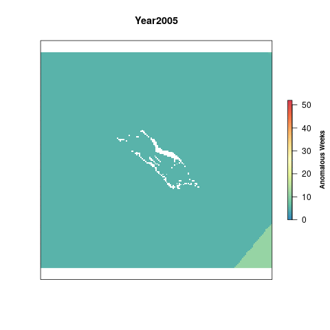
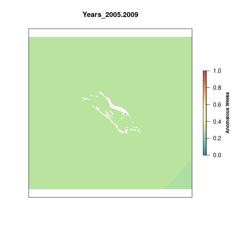

# Summary 

The Ultraviolet Radiation pressure layer is generated from daily data on Local Noon Erythemal UV Irradiance (mW/m2) derived from satellite observations. 

For the global OHI assessment, the raw data is processed into anomaly products. The data product of that process are rasters of total number of weekly anomalies per year. An anomaly is defined as greater than the mean climatology plus 1 standard deviation for that cell across the entire dataset (2005-2016).

This script takes the global anomaly rasters and crops them to Palmyra. This time we have decided to use a reference point that represents a regime shift. Once a given cell is anomalous for more than 50% of a five-year period, it has shifted into a new regime. All cells that have a value greater than 130 weeks (51% of a 5 year time period) are assigned a 1. The rest of the cells are scaled to this reference point by dividing by 130.  

# Data

The Ultraviolet Radiation pressures layer uses the [Aura OMI GLobal Surface UVB Data Product](https://disc.gsfc.nasa.gov/uui/datasets/OMUVBG_V003/summary#).  

**Native Data Resolution**: 0.25 degrees  
**Values**: OMI/Aura Surface UVB Irradiance and Erythemal Dose Daily L2 Global Gridded 0.25 degree x 0.25 degree V3  
**Time Range**: Daily data from 2005 - 2019  
**Format**: HDF5

Citation: Jari Hovila, Antii Arola, and Johanna Tamminen (2014), OMI/Aura Surface UVB Irradiance and Erythemal Dose Daily L2 Global Gridded 0.25 degree x 0.25 degree V3, NASA Goddard Space Flight Center, Goddard Earth Sciences Data and Information Services Center (GES DISC), Accessed [June 22, 2020] DOI:10.5067/Aura/OMI/DATA2028.  

# Setup 

```{r setup, message = F, warning = F}
knitr::opts_chunk$set(echo = FALSE)

library(tidyverse)
library(doParallel)
library(foreach)
library(rworldmap)
library(raster)
library(janitor)
library(ggplot2)
library(lubridate)
library(here)

# Source and set file paths
source(here('src/R/common.R'))

dir_prs   <- '~/github/pal-prep/prep/pressures/uv/v2020'
```

# Methods

## Get Global Data

We will use the global data that was processed for OHI Global 2020, which includes data from 2005 - 2019. This data is saved on a server at NCEAS.   

```{r get-global-uv-data, eval=F}

anom_files <- list.files(file.path(glb_anx, 'prs_uv/v2020/int/annual_anomalies_diff'),
                         pattern = "annual_pos",
                         full.names = T)

# Get world map and plot the most recent year of data:
world = getMap()

plot(raster(anom_files[15]), col=cols, main = "UV Radiation Anomalies 2019", box=F, axes=F,
     legend.args=list(text='Anomalous Weeks', side=4, font=2, line=2.5, cex=0.8))
plot(world, col='black', add=T)
```

## Crop to Palmyra

Using the `crop` function from the `raster` package we crop all uv rasters to the Palmyra extent and then reproject them to the US Albers projection for consistency across the assessment. We crop the global rasters first to reduce the time it takes to reproject the rasters. `ocean_ras_50nm` is used as a mask to remove land cells from the raster for better visuals.  


```{r crop-to-pal, eval=F}
registerDoParallel(10) # Register 10 cores for parallel processing

foreach(f = anom_files) %dopar% {
  #f = anom_files[15]
  
  if(!file.exists(paste0(dir_anx,'/dataprep/prs_uv/output/uv_annual_anoms/annual_anom_',
                         substr(basename(f), 22, 25),'.tif'))) {
    
  raster(f) %>%
    projectRaster(ocean_rast3_100, method = 'ngb') %>%
    crop(usalb_ext3) %>%  
    mask(ocean_rast3_100, filename = paste0(dir_anx, '/dataprep/prs_uv/output/uv_annual_anoms/annual_anom_',
                                             substr(basename(f), 22, 25),'.tif'), overwrite=T)
    
  } else {
    message("Raster exists")
  }
}
 
```

```{r check, eval=F, include=F}
# Check a few rasters to make sure this makes sense:
check07 <- raster(file.path(dir_anx, '/dataprep/prs_uv/output/uv_annual_anoms/annual_anom_2007.tif'))
check19 <- raster(file.path(dir_anx, '/dataprep/prs_uv/output/uv_annual_anoms/annual_anom_2019.tif'))
    
plot(check07, col=cols, 
     main = "Ultraviolet Radiation 2007", 
     legend.args=list(text='Anomalous Weeks', side=4, font=2, line=2.5, cex=0.8))

plot(check19, col=cols, 
     main = "Ultraviolet Radiation 2016",
     legend.args=list(text='Anomalous Weeks', side=4, font=2, line=2.5, cex=0.8))
```


## Visualize Change

Visualize the change in radiation anomalies over time.   

```{r gif1, eval=F}

l <- lapply(list.files(file.path(dir_anx, "/dataprep/prs_uv/output/uv_annual_anoms"), full.names=T), raster) %>%
                brick()

names(l) <- paste0("Year", (substr(names(l),13,16))) # Rename each layer for plotting

# Make a gif animation
library(animation)

saveGIF({
  for(i in 1:nlayers(l)){
      # don't forget to fix the zlimits
      plot(l[[i]], zlim=c(0,52), axes=F, col=cols,
           main=names(l[[i]]),
           legend.args=list(text='Anomalous Weeks', side=4, font=2, line=2.5, cex=0.8))
      
  }
}, movie.name = 'uv_annual_anoms.gif')
```



## Five-year Aggregates

Calculate total anomalous weeks for each 5-year period from 2005 - 2019.         

```{r, five-year, eval=F}

l <- list.files(file.path(dir_anx, "/dataprep/prs_uv/output/uv_annual_anoms"), full.names=T)

# Last 5 year periood will start in 2015
for(i in 2005:2015){ #i=2005
  
  yrs <- c(i,i+1,i+2,i+3,i+4)
  s   <- stack(l[substr(basename(l), 13, 16)%in%yrs]) %>% sum(.)
  
  writeRaster(s, filename = paste0(dir_anx, "/dataprep/prs_uv/output/uv_sum_anoms/sum_anoms_",
                                   min(yrs), '-', max(yrs), '.tif'), overwrite=T)
}
```

## Rescale

To account for annual variation, we look at UV anomalies in 5 year periods, so the maximum value possible per cell is 260 anomalous weeks. To rescale the values from 0 to 1 we need to set a reference point. Previously, the reference point for UV has just been the maximum difference in anomalous weeks between the most recent time period and a historical reference period (2005-2009).

This time we have decided to use a reference point that represents a regime shift. Once a given cell is anomalous for more than 50% of a five-year period, it has shifted into a new regime. All cells that have a value greater than 130 weeks (51% of a 5 year time period) are assigned a 1. The rest of the cells are scaled to this reference point by dividing by 130.

```{r rescale, eval=F}

uv_aggs <- list.files(file.path(dir_anx, "/dataprep/prs_uv/output/uv_sum_anoms"), full.names=T)

# Define the rescale function
resc_func <- function(x){
  
  # Get the year from the file for naming the output raster
  yrs <- substr(basename(x), 11, 19)
 
  # If a cell value is >= the reference point (130 weeks), assign a value of 1, otherwise divide by the reference point
  raster(x) %>%
  calc(.,fun=function(x){ifelse(x<0, 0, ifelse(x>130, 1, x/130))},
         filename = paste0(dir_anx, '/dataprep/prs_uv/output/uv_rescaled/uv_rescale_', yrs, '.tif'), overwrite=T)
}

# Rescale 
foreach(file = uv_aggs) %dopar% {
  resc_func(file)
}
```

## Presure Over Time

Visualize the change in aggregated radiation anomolies over time.   

```{r gif_rescale, eval = F}

resc <- lapply(list.files(file.path(dir_anx, '/dataprep/prs_uv/output/uv_rescaled'), full.names=T), raster) %>% 
  brick()

names(resc) <- paste0("Years_", (substr(names(resc), 12, 20)))
gsub(".", "-", names(resc), fixed = TRUE)

# Create a gif of values over time
saveGIF({
  for(i in 1:nlayers(resc)){
      # Don't forget to fix the zlimits
      plot(resc[[i]], zlim=c(0,1), axes=F, col=cols,
           main=names(resc[[i]]),
           legend.args=list(text='Anomalous Weeks', side=4, font=2, line=2.5, cex=0.8))
      
  }
}, movie.name = 'uv_rescale.gif')
```

   

# Results

## Scores

```{r uv-scores, eval=F}

# Use the rescaled files for scores
uv_stack <- lapply(list.files(file.path(dir_anx, '/dataprep/prs_uv/output/uv_rescaled'),full.names=T), raster) %>%
  brick()

# Find the mean 
pal_stats <- zonal(uv_stack,  ocean_rast3_100, fun="mean", na.rm=TRUE, progress="text") %>%
                  data.frame() %>% 
                  clean_names()

# Convert into a data frame, add additional columns
uv_data <- pivot_longer(pal_stats,
                        cols = uv_rescale_2005_2009:uv_rescale_2015_2019,
                        names_to = "years", values_to = "pressure_score") %>% 
  mutate(
    year = substr(years,17,20),
    year = as.numeric(year)) %>% 
  dplyr::select(region_id = zone, year, pressure_score)

# Save to output folder
write_csv(uv_data, file.path(dir_prs, "output/uv_pressure.csv"))
```

## Save To Toolbox

```{r save-to-toolbox, eval=F}

```


## Final Visualization

```{r uv-viz}
uv_data <- read_csv("output/uv_pressure.csv")


ggplot(uv_data, aes(x = year, y = pressure_score)) +
  geom_line() + 
  scale_x_continuous(expand = c(0,0), breaks = seq(2010,2018, by=2),
                     limits = c(2009,2019)) + 
  scale_y_continuous(expand = c(0,0), limits = c(0.25,0.45)) + 
  labs(y = "Pressure Score", x = "Year") + 
  theme_minimal()
```

This code chunk creates a google visualization of the scores through time. It unfortunately does not allow the google chart to show up in the RMarkdown knitted document.

```{r googlevis}
library(googleVis)

plotData <- uv_data %>%
  dplyr::select(region_id, year, pressure_score)

Motion <- gvisMotionChart(plotData, 
                       idvar="region_id", 
                       timevar="year")
plot(Motion)
print(Motion, file='uv.html')
```
